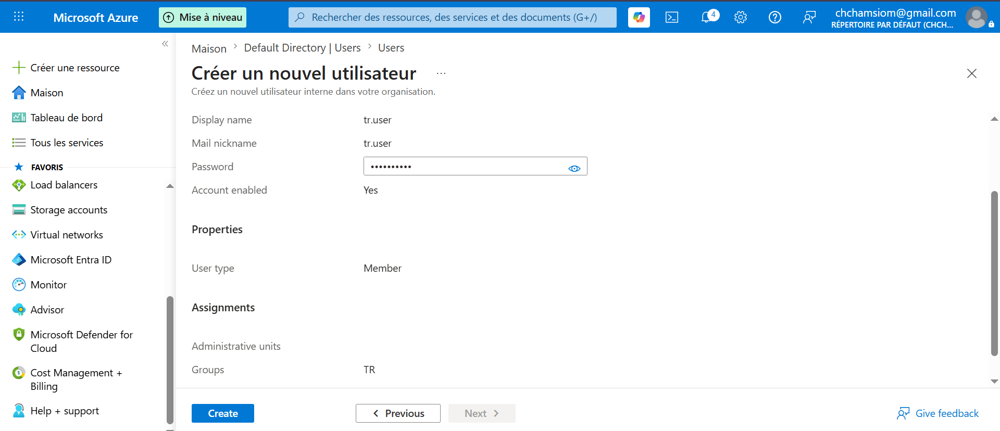

## Création des utilisateurs

Utilisateurs créés :
- ItUser
- RhUser
- financeuser
- TrUser

### Étapes
- GIF: `../images/users/create-users-etape-1.png`

- 1. Aller dans Entra ID

- GIF: `../images/users/create-users-etape-1.png`

- 2. Users -> New user

- GIF: `../images/users/create-users-etape-1.png`

- 3. Remplir nom + username

- GIF: `../images/users/create-users-etape-1.png`

- 4. Ajouter mot de passe temporaire

- GIF: `../images/users/create-users-etape-1.png`

- 5. Créer l'utilisateur
