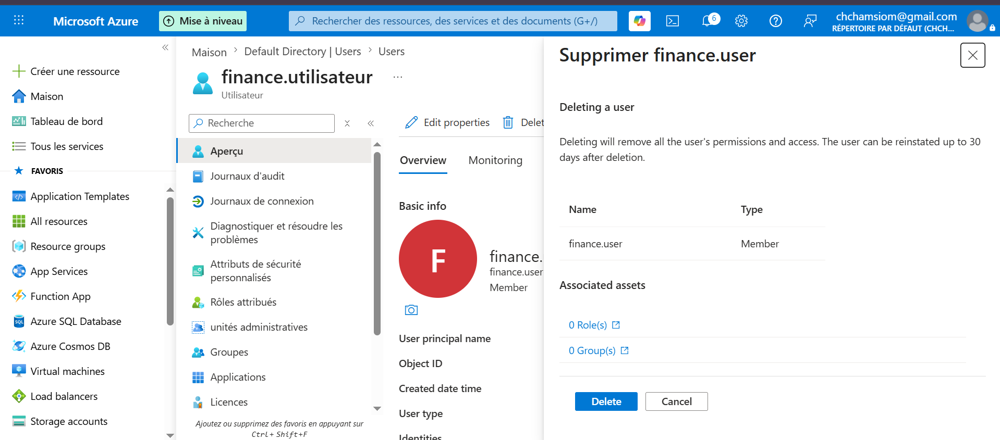
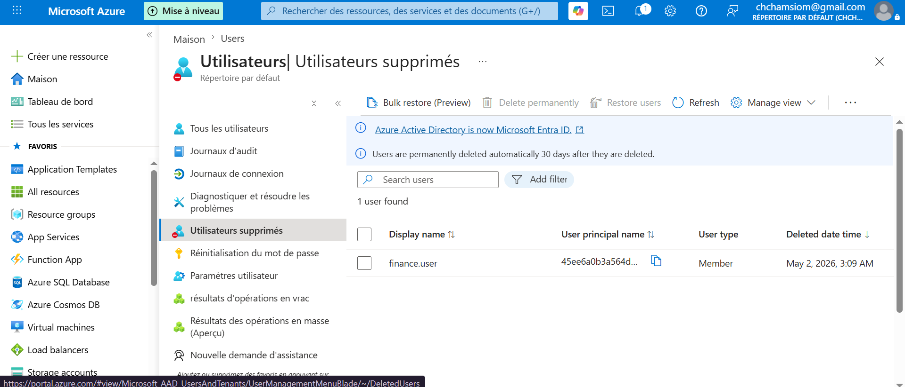
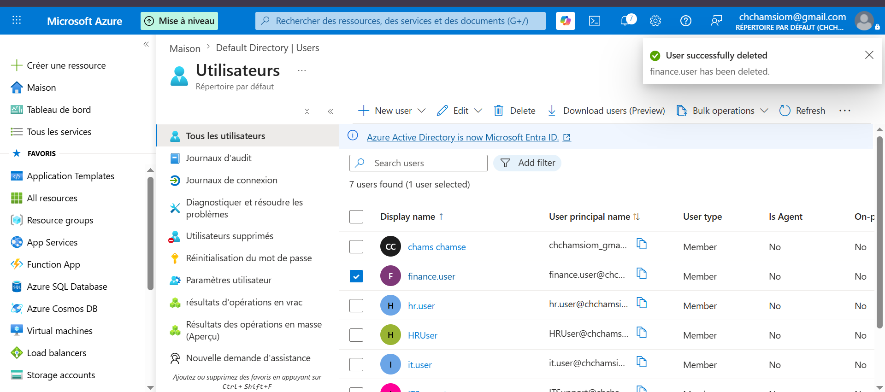
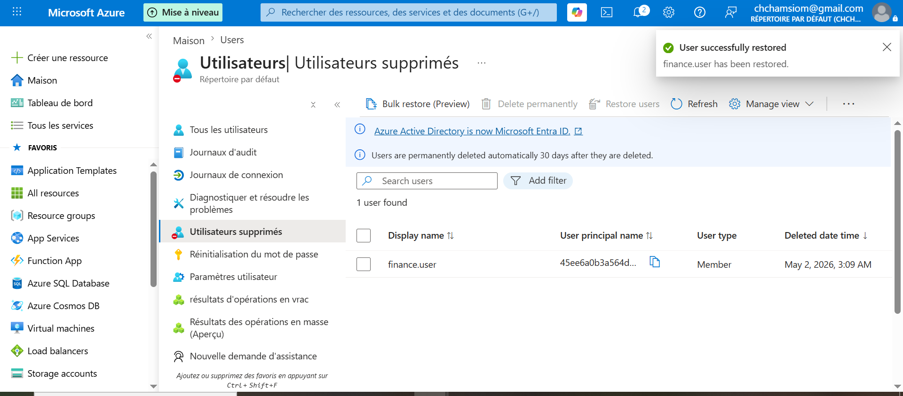

## Cycle de vie utilisateur

Actions :
- Block sign-in
- Enable user
- Delete user
- Restore user

### Block sign-in
- Test : accès refusé
- Cas : départ employé

### Enable user

- Test : accès OK
- Cas : retour employé

### Delete user

- Test : compte supprimé
- Cas : suppression RH

### Restore user

- Test : compte restauré
- Cas : erreur suppression

### Cas réel
Employé quitte -> disable account