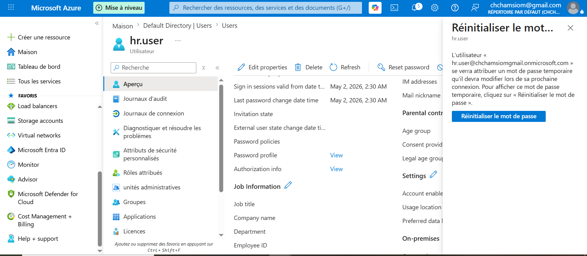
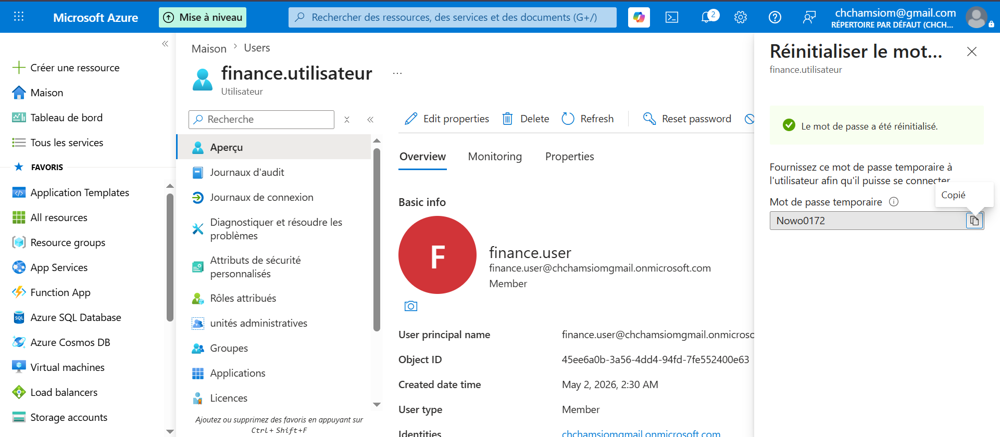

## Gestion des mots de passe

Actions réalisées :
- Reset password
- Require password change at next login

### Cas réel
User oublie mot de passe -> reset

3 etapes reset password:
- 1. Ouvrir l'utilisateur

-

- 2. Cliquer sur Reset password

- 3. Valider et communiquer le nouveau mot de passe

